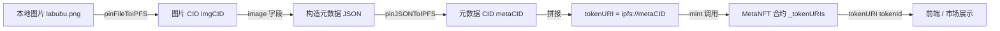

# NFT 铸造技术文档：从图片上传到 Token URI

> 适用项目：本仓库（Hardhat 3 + ethers v6 + TypeScript，`MetaNFT.sol`）
> 覆盖流程：**上传图片 → 组装 Meta JSON → 生成 Token URI → 链上设置/前端调用**
> 文档中的所有代码均可直接复制运行（需先完成 1.3 节环境变量配置）。

---

## 目录

- [0. 整体流程概览](#0-整体流程概览)
- [1. 前置准备](#1-前置准备)
- [2. 上传图片到 Pinata](#2-上传图片到-pinata)
- [3. 组装 Meta JSON](#3-组装-meta-json)
- [4. 生成 Token URI](#4-生成-token-uri)
- [5. 完整一键脚本](#5-完整一键脚本)
- [6. 常见问题 FAQ](#6-常见问题-faq)
- [附录 A：API 端点汇总](#附录-aapi-端点汇总)
- [附录 B：错误码与处理](#附录-b错误码与处理)

---

## 0. 整体流程概览



| 阶段 | 产物 | 说明 |
| --- | --- | --- |
| 1. 上传图片 | `imgCID`（如 `bafybeids4muu...`） | 图片本身存 IPFS，得到内容寻址 CID |
| 2. 组装 Meta JSON | `metaCID` | 元数据 JSON（name / description / image / attributes），`image` 字段填 `ipfs://<imgCID>` |
| 3. 生成 Token URI | `tokenURI = "ipfs://<metaCID>"` | 合约 `mint(to, tokenURI_)` 入参，`tokenURI(tokenId)` 原样返回 |

> 核心概念：**Token URI 指向的是元数据 JSON，而不是图片本身**。图片只是 JSON 中 `image` 字段的值。IPFS 是内容寻址，同一份内容任何节点算出的 CID 都相同。

---

## 1. 前置准备

### 1.1 注册 Pinata 并获取 API 密钥

1. 打开 [app.pinata.cloud](https://app.pinata.cloud) 注册/登录（免费档：1GB 存储、每月 100MB 上传、单文件 100MB）。
2. 左侧菜单 **API Keys** → 右上角 **New Key** → 权限勾选 **Admin**（或至少勾选 `pinFileToIPFS` 的 `pin` 权限）。
3. 创建成功后页面会显示三项，**JWT 只显示一次，务必立刻复制保存**：

| 配置项 | 示例 | 用途 |
| --- | --- | --- |
| `PINATA_JWT` | `eyJhbGciOi...` | 请求头 `Authorization: Bearer <JWT>`，推荐认证方式 |
| `pinata_api_key` | `xxxxxxxx` | 旧式认证（请求头），与 secret 配对使用 |
| `pinata_secret_api_key` | `xxxxxxxx` | 旧式认证 |
| Gateway 域名 | `magenta-far-wildfowl-701.mypinata.cloud` | 通过 HTTP 网关读取 IPFS 内容（你的账号网关） |

> JWT 的 `scope` 中应包含 `pinFileToIPFS` / `pinJSONToIPFS` 端点权限，可在 [jwt.io](https://jwt.io) 解码校验。

### 1.2 安装依赖

```bash
# 官方 SDK（可选，不装也能用原生 fetch）
npm i pinata

# 环境变量加载（若项目尚无 dotenv）
npm i -D dotenv
```

> Node.js ≥ 18 自带 `fetch` / `FormData` / `Blob`，本文示例均基于原生 API，无需 `axios` / `form-data`。

### 1.3 配置环境变量

在项目根目录新建 `.env`（**不要提交到 git**，已确认 `.gitignore` 忽略）：

```bash
# .env
PINATA_JWT=eyJhbGciOi...            # 从 Pinata 控制台复制
PINATA_GATEWAY=magenta-far-wildfowl-701.mypinata.cloud
```

在 TS 中加载（Hardhat 项目通常已内置 `dotenv` 支持，若否）：

```ts
import "dotenv/config";

const JWT = process.env.PINATA_JWT;
if (!JWT) throw new Error("缺少 PINATA_JWT，请检查 .env");
```

---

## 2. 上传图片到 Pinata

### 2.1 接口说明：`pinFileToIPFS`

| 项 | 值 |
| --- | --- |
| 端点 | `POST https://api.pinata.cloud/pinning/pinFileToIPFS` |
| 认证 | `Authorization: Bearer <JWT>`（或 `pinata_api_key` + `pinata_secret_api_key` 两个请求头） |
| 请求体 | `multipart/form-data`（**不要手动设置 Content-Type**，fetch 会自动带 boundary） |
| 响应 | `{ IpfsHash, PinSize, Timestamp, isDuplicate }` |

表单字段：

| 字段 | 必填 | 说明 |
| --- | --- | --- |
| `file` | ✅ | 文件二进制，字段名固定为 `file` |
| `pinataMetadata` | 可选 | JSON 字符串，如 `{"name": "labubu.png"}`，便于在控制台管理 |
| `pinataOptions` | 可选 | JSON 字符串，如 `{"cidVersion": 1}`（推荐，返回 CIDv1） |

### 2.2 curl 快速验证

```bash
curl -X POST "https://api.pinata.cloud/pinning/pinFileToIPFS" \
  -H "Authorization: Bearer $PINATA_JWT" \
  -F "file=@./labubu.png" \
  -F "pinataMetadata={\"name\":\"labubu.png\"};type=application/json" \
  -F "pinataOptions={\"cidVersion\":1};type=application/json"
```

预期响应：

```json
{
  "IpfsHash": "bafybeids4muulf53hxcjdy5sa3jdjd5d2xw5qn6bgnodvo766uktxjy7l4",
  "PinSize": 1210986,
  "Timestamp": "2026-08-02T15:00:00.000Z",
  "isDuplicate": false
}
```

### 2.3 TypeScript 示例（推荐）

`scripts/pin-file.ts`

```ts
import "dotenv/config";
import { readFileSync } from "node:fs";
import path from "node:path";

const JWT = process.env.PINATA_JWT!;
const API = "https://api.pinata.cloud";

/**
 * 上传单个文件到 IPFS
 * @param filePath 本地图片绝对/相对路径
 * @param name     Pinata 控制台显示名（可选）
 * @returns        IPFS CID（CIDv1，如 bafybeids...）
 */
export async function uploadFileToIPFS(filePath: string, name?: string): Promise<string> {
  const form = new FormData();
  // Node 18+：Blob 支持 Buffer 输入
  form.append("file", new Blob([readFileSync(filePath)]), path.basename(filePath));
  form.append("pinataMetadata", JSON.stringify({ name: name ?? path.basename(filePath) }));
  form.append("pinataOptions", JSON.stringify({ cidVersion: 1 }));

  const res = await fetch(`${API}/pinning/pinFileToIPFS`, {
    method: "POST",
    headers: { Authorization: `Bearer ${JWT}` },
    body: form,
  });

  if (!res.ok) {
    throw new Error(`pinFileToIPFS 失败 [${res.status}]: ${await res.text()}`);
  }

  const data = (await res.json()) as {
    IpfsHash: string;
    PinSize: number;
    Timestamp: string;
    isDuplicate?: boolean;
  };

  if (data.isDuplicate) {
    console.warn("⚠️ 该内容此前已存在，返回的即已有 CID（内容寻址特性）");
  }
  console.log(`✅ 图片已上传，CID = ${data.IpfsHash}`);
  return data.IpfsHash;
}

// 直接运行：npx tsx scripts/pin-file.ts
if (import.meta.url === `file://${process.argv[1]}`) {
  uploadFileToIPFS("./labubu.png").catch((e) => {
    console.error(e);
    process.exit(1);
  });
}
```

### 2.4 官方 SDK 方式（等价）

```ts
import { PinataSDK } from "pinata";
import { readFileSync } from "node:fs";

const pinata = new PinataSDK({
  pinataJwt: process.env.PINATA_JWT!,
  pinataGateway: process.env.PINATA_GATEWAY!,
});

const file = new File([readFileSync("./labubu.png")], "labubu.png", {
  type: "image/png",
});

const upload = await pinata.upload.public.file(file);
console.log("CID:", upload.cid); // bafybeids...
```

### 2.5 获取 CID 与验证

- 响应中的 `IpfsHash` 即 **CID（Content Identifier）**，是内容的唯一指纹。
- **CIDv0**：以 `Qm` 开头（base58，多用于老工具）；**CIDv1**：以 `bafy` 开头（base32，推荐，兼容性更好）。
- 用你自己的网关验证（浏览器可打开）：

```
https://<PINATA_GATEWAY>/ipfs/bafybeids4muulf53hxcjdy5sa3jdjd5d2xw5qn6bgnodvo766uktxjy7l4
```

### 2.6 错误处理

| 场景 | 表现 | 处理 |
| --- | --- | --- |
| JWT 无效/过期 | `401 Unauthorized` | 控制台重新生成 JWT，更新 `.env` |
| 文件过大 | `413` | 免费档单文件上限 100MB；压缩图片（如 `sips -Z 2000`）后再传 |
| 请求限流 | `429` | 指数退避重试：`sleep(2^n)`，最多重试 3 次 |
| 网络超时 | `fetch failed` / ETIMEDOUT | 国内网络直连 Pinata 不稳定，给 Node 配代理后重试 |
| 重复内容 | 响应 `isDuplicate: true` | 非错误，CID 与已存内容相同（内容寻址的必然结果） |

代理（可选）：Pinata 为境外服务，若直连失败，可给脚本注入代理环境变量：

```bash
HTTPS_PROXY=http://127.0.0.1:7897 npx tsx scripts/pin-file.ts
```

---

## 3. 组装 Meta JSON

### 3.1 NFT 元数据标准

ERC-721 / ERC-1155 的元数据是一段 JSON，**业界通行的格式是 OpenSea Metadata Standards**：

| 字段 | 必填 | 类型 | 说明 |
| --- | --- | --- | --- |
| `name` | ✅ | string | NFT 名称，如 `Labubu #1` |
| `description` | ✅ | string | 描述 |
| `image` | ✅ | string | 图片 URI，填上一步的 `ipfs://<imgCID>` |
| `external_url` | 可选 | string | 项目主页 |
| `attributes` | 可选 | array | 特性数组 `[{ trait_type, value }]`，市场据此渲染属性面板 |
| `edition` / `animation_url` / `background_color` | 可选 | - | 扩展字段 |

> 元数据规范与 `ERC721Metadata` 的 `tokenURI()` 解耦：合约只负责返回 URI，解析 JSON 是钱包/市场的职责。字段不合法最多导致市场展示异常，不会导致合约 revert。

### 3.2 基于 CID 构造元数据 JSON

`scripts/build-metadata.ts`

```ts
export interface NFTMetadata {
  name: string;
  description: string;
  image: string;
  external_url?: string;
  attributes: { trait_type: string; value: string | number }[];
}

export function buildMetadata(
  imgCID: string,
  opts: { name: string; description: string; externalUrl?: string; attributes?: NFTMetadata["attributes"] },
): NFTMetadata {
  return {
    name: opts.name,
    description: opts.description,
    // 关键：image 字段填 IPFS URI 而不是 https 网关地址
    image: `ipfs://${imgCID}`,
    external_url: opts.externalUrl,
    attributes: opts.attributes ?? [],
  };
}

// 示例
const metadata = buildMetadata("bafybeids4muulf53hxcjdy5sa3jdjd5d2xw5qn6bgnodvo766uktxjy7l4", {
  name: "Labubu #1",
  description: "A cute Labubu doll from the mystery box series.",
  attributes: [{ trait_type: "Series", value: "Labubu" }],
});
```

### 3.3 上传 JSON 到 Pinata：`pinJSONToIPFS`

| 项 | 值 |
| --- | --- |
| 端点 | `POST https://api.pinata.cloud/pinning/pinJSONToIPFS` |
| 认证 | `Authorization: Bearer <JWT>` |
| 请求体 | `application/json`，结构为 `{ pinataContent, pinataMetadata, pinataOptions }` |
| 响应 | `{ IpfsHash, PinSize, Timestamp, isDuplicate }` |

```ts
export async function uploadJSONToIPFS(metadata: object, name: string): Promise<string> {
  const res = await fetch(`${API}/pinning/pinJSONToIPFS`, {
    method: "POST",
    headers: {
      "Content-Type": "application/json",
      Authorization: `Bearer ${JWT}`,
    },
    body: JSON.stringify({
      pinataContent: metadata,          // ← 你的元数据本体
      pinataMetadata: { name },         // 如 "1.json"
      pinataOptions: { cidVersion: 1 },
    }),
  });

  if (!res.ok) {
    throw new Error(`pinJSONToIPFS 失败 [${res.status}]: ${await res.text()}`);
  }

  const data = (await res.json()) as { IpfsHash: string };
  console.log(`✅ 元数据已上传，metaCID = ${data.IpfsHash}`);
  return data.IpfsHash; // 即 metaCID
}

// 用法
const metaCID = await uploadJSONToIPFS(metadata, "1.json");
console.log(`metadata URI = ipfs://${metaCID}`);
```

### 3.4 批量生成（集合级铸造常用）

```ts
import { readFileSync, writeFileSync } from "node:fs";

async function mintCollectionBatch(imgCIDs: string[], baseName: string) {
  const metaCIDs: string[] = [];
  for (let i = 0; i < imgCIDs.length; i++) {
    const metadata = buildMetadata(imgCIDs[i], {
      name: `${baseName} #${i + 1}`,
      description: `${baseName} collection, item #${i + 1}`,
    });
    // 可选：本地留档一份
    writeFileSync(`./metadata/${i + 1}.json`, JSON.stringify(metadata, null, 2));
    const cid = await uploadJSONToIPFS(metadata, `${i + 1}.json`);
    metaCIDs.push(cid);
    console.log(`#${i + 1} metaCID = ${cid}`);
  }
  return metaCIDs;
}
```

> 注意：**元数据 JSON 与图片一样必须 pin**。只 pin 图片、JSON 没人 pin，内容可能在节点清理后丢失，导致 NFT 变"无图"。IPFS 内容不可变——想改元数据只能重新上传新 JSON 获得新 CID。

---

## 4. 生成 Token URI

### 4.1 URI 拼接规范

```
tokenURI = "ipfs://" + metaCID
// 例：ipfs://bafybeigdyrzt5sfp7udm7hu76uh7y26nf3efuylqabf3oclgtqy55fbzdi
```

- ✅ 推荐存 `ipfs://<CID>`：去中心化、与网关无关、市场/钱包可自行解析。
- ❌ 不推荐存 `https://<gateway>/ipfs/<CID>`：绑定单点网关，网关挂掉则 NFT 打不开；主流市场虽兼容，但链上数据不宜耦合中心化地址。

### 4.2 合约侧设置（本项目 `MetaNFT.sol`）

本项目 `contracts/MetaNFT.sol` 采用「mint 时直接写入 tokenURI」的方式：

```solidity
// contracts/MetaNFT.sol（关键片段）
mapping(uint256 => string) private _tokenURIs;

function mint(address to, string memory tokenURI_) external onlyOwner returns (uint256) {
    uint256 tokenId = _nextTokenId++;          // 以实际实现为准
    _mint(to, tokenId);
    _tokenURIs[tokenId] = tokenURI_;           // ← tokenURI 即元数据 URI，原样存储
    emit MintNftToken(to, tokenId, tokenURI_);
}

function tokenURI(uint256 tokenId) public view override returns (string memory) {
    // 不存在的 tokenId 会 revert（ERC721NonexistentToken）
    return _tokenURIs[tokenId];
}
```

**部署 + 铸造（Hardhat Ignition + ethers v6）**，`scripts/mint-nft.ts`：

```ts
import { ethers, ignition } from "hardhat";
import MetaNFTAuctionModule from "../ignition/modules/MetaNFTAuctionTransparent"; // 按你的部署模块调整

async function main() {
  // 1. 部署（若尚未部署）
  const { nft } = await ignition.deploy(MetaNFTAuctionModule);
  const nftAddr = await nft.getAddress();
  console.log("MetaNFT deployed at:", nftAddr);

  // 2. 读取合约实例
  const metaNft = await ethers.getContractAt("MetaNFT", nftAddr);
  const [owner] = await ethers.getSigners();

  // 3. 铸造：传入 tokenURI = ipfs://<metaCID>
  const metaCID = "bafybeigdyrzt5sfp7udm7hu76uh7y26nf3efuylqabf3oclgtqy55fbzdi"; // 第 3 步产物
  const tokenURI_ = `ipfs://${metaCID}`;

  const tx = await metaNft.mint(owner.address, tokenURI_);
  const receipt = await tx.wait();
  console.log("mint tx:", receipt?.hash);

  // 4. 校验
  const tokenId = 1n; // 以事件/返回值实际 tokenId 为准
  const uri = await metaNft.tokenURI(tokenId);
  console.log(`tokenURI(${tokenId}) =`, uri);
  if (uri !== tokenURI_) throw new Error("tokenURI 与预期不一致！");
  console.log("✅ 链上 tokenURI 设置成功");
}

main().catch((e) => {
  console.error(e);
  process.exit(1);
});
```

运行：

```bash
npx hardhat run scripts/mint-nft.ts --network sepolia
```

### 4.3 前端调用合约方法（简要）

前端（本项目 `frontend/`）通过 ethers v6 与合约交互：

```ts
import { ethers } from "ethers";

const provider = new ethers.BrowserProvider(window.ethereum); // MetaMask
await provider.send("eth_requestAccounts", []);
const signer = await provider.getSigner();

const nft = new ethers.Contract(NFT_ADDRESS, NFT_ABI, signer);

// 铸造（需要 owner 钱包）
const tx = await nft.mint(await signer.getAddress(), "ipfs://<metaCID>");
await tx.wait();

// 读取 tokenURI 并拼网关 URL 展示图片
const uri = await nft.tokenURI(1n); // "ipfs://bafybei..."
const gatewayUrl = `https://${process.env.PINATA_GATEWAY}/ipfs/${uri.replace("ipfs://", "")}`;
```

### 4.4 端到端验证

铸造完成后，用 `node` 脚本或浏览器手动走一遍完整链路：

```
tokenURI(1)  →  "ipfs://bafybeigdyrzt5sfp7udm7hu76uh7y26nf3efuylqabf3oclgtqy55fbzdi"
      ↓ 替换 ipfs:// 前缀
https://<gateway>/ipfs/bafybeigdyrzt5sfp7udm7hu76uh7y26nf3efuylqabf3oclgtqy55fbzdi
      ↓ 浏览器打开 → 元数据 JSON
image: "ipfs://bafybeids4muulf53hxcjdy5sa3jdjd5d2xw5qn6bgnodvo766uktxjy7l4"
      ↓ 再拼网关
https://<gateway>/ipfs/bafybeids4muulf53hxcjdy5sa3jdjd5d2xw5qn6bgnodvo766uktxjy7l4
      ↓ 显示图片（Labubu 玩偶 PNG）
```

> 也可以在 [ipfs.io](https://ipfs.io)、[nft.storage](https://nft.storage) 等公共网关交叉验证，确认内容已广播到 IPFS 网络。

### 4.5 错误处理

| 场景 | 表现 | 处理 |
| --- | --- | --- |
| token 不存在 | `tokenURI(99)` revert `ERC721NonexistentToken` | 属预期行为，前端应先校验 tokenId 合法性 |
| 非 owner 调 mint | revert（`onlyOwner` 修饰符） | mint 权限仅在合约 owner；前端需用 owner 钱包签名 |
| RPC 不可达 | `request failed` / `NETWORK_ERROR` | 检查 `hardhat.config.ts` 的 `networks.<name>.url`；本地节点未启动则先 `npx hardhat node` |
| gas 不足 | `insufficient funds` | 给部署钱包充值测试币（如 Sepolia 水龙头） |
| 代理未配置 | 部署/读取超时 | 境外 RPC 走代理：`HTTPS_PROXY=http://127.0.0.1:7897 npx hardhat run ...` |

---

## 5. 完整一键脚本

`scripts/full-mint.ts`：上传图片 → 组 JSON → 上传 JSON → mint → 打印 tokenURI，一步到位。

```ts
import "dotenv/config";
import { ethers, ignition } from "hardhat";
import { uploadFileToIPFS } from "./pin-file";
import { buildMetadata } from "./build-metadata";
import { uploadJSONToIPFS } from "./build-metadata"; // 见 3.3 节实现
import MetaNFTAuctionModule from "../ignition/modules/MetaNFTAuctionTransparent";

async function main() {
  // ── Step 1：上传图片 ────────────────────────────────
  const imgCID = await uploadFileToIPFS("./labubu.png", "labubu.png");

  // ── Step 2：组装并上传元数据 JSON ──────────────────
  const metadata = buildMetadata(imgCID, {
    name: "Labubu #1",
    description: "A cute Labubu doll from the mystery box series.",
    attributes: [{ trait_type: "Series", value: "Labubu" }],
  });
  const metaCID = await uploadJSONToIPFS(metadata, "1.json");

  // ── Step 3：部署 + mint ─────────────────────────────
  const { nft } = await ignition.deploy(MetaNFTAuctionModule);
  const nftAddr = await nft.getAddress();
  const [owner] = await ethers.getSigners();

  const tokenURI_ = `ipfs://${metaCID}`;
  const tx = await (await ethers.getContractAt("MetaNFT", nftAddr)).mint(owner.address, tokenURI_);
  await tx.wait();

  console.log("\n================ 铸造完成 ================");
  console.log("合约地址 :", nftAddr);
  console.log("图片 CID  :", imgCID);
  console.log("元数据CID :", metaCID);
  console.log("tokenURI  :", tokenURI_);
  console.log("网关访问  :", `https://${process.env.PINATA_GATEWAY}/ipfs/${metaCID}`);
}

main().catch((e) => {
  console.error(e);
  process.exit(1);
});
```

```bash
npx hardhat run scripts/full-mint.ts --network sepolia
```

## 6. 手工实测
1、上传照片到pinata 取得cid：bafybeids4muulf53hxcjdy5sa3jdjd5d2xw5qn6bgnodvo766uktxjy7l4
2、组装原数据json，并上传元数据到pinata 取得cid：bafkreifbt333tst4mstbnaja7reuj32lewz523wu63unz67c5e3abipqx4
```
{
  "name": "Labubu #1",
  "description": "A cute Labubu doll",
  "image": "ipfs://bafybeids4muulf53hxcjdy5sa3jdjd5d2xw5qn6bgnodvo766uktxjy7l4",
  "attributes": [{"trait_type": "Series", "value": "Labubu"}]
}
```
3、组装tokenuri：ipfs://bafkreifbt333tst4mstbnaja7reuj32lewz523wu63unz67c5e3abipqx4

ipfs://bafkreidw3oa524avgv4jzipq7z53ss55neybz34sqngnh5jfqkihazv4vy
---

## 6. 常见问题 FAQ

**Q1：`pinFileToIPFS` 返回的 `IpfsHash` 是什么？**
A：IPFS 内容的 CID（内容标识符）。它是内容的 SHA-256 等哈希编码，内容不变则 CID 永远相同——这也是为什么重复上传会返回 `isDuplicate: true`。

**Q2：为什么我的 CID 是 `bafy...` 而不是 `Qm...`？**
A：`Qm` 开头是 CIDv0（老格式），`bafy` 开头是 CIDv1（推荐）。本文所有请求都传了 `pinataOptions.cidVersion: 1`。

**Q3：tokenURI 存的是图片地址还是 JSON 地址？**
A：**JSON 地址**。合约 `tokenURI(tokenId)` 返回的是元数据 JSON 的 URI；图片地址在 JSON 的 `image` 字段里。这是新手最常见的混淆点。

**Q4：元数据想改了怎么办？**
A：IPFS 内容不可变。重新上传修改后的 JSON 得到新 CID；若合约没有 `setTokenURI`，则原 NFT 的 URI 无法修改（这正是"元数据不可篡改"的 NFT 特性）。需要可升级方案可改用本仓库的 UUPS / Transparent 代理模式。

**Q5：直接访问 Pinata 很慢/失败？**
A：Pinata 是境外服务，本机走 Clash 代理（`127.0.0.1:7897`）可解决；node 进程默认不读系统代理，需显式设置 `HTTPS_PROXY` 环境变量。

**Q6：免费套餐够用吗？**
A：学习/作业场景足够：免费档 1GB 存储、每月 100MB 上传、单文件 100MB 上限。

---

## 附录 A：API 端点汇总

| 端点 | 方法 | 用途 |
| --- | --- | --- |
| `https://api.pinata.cloud/pinning/pinFileToIPFS` | POST | 上传文件（multipart/form-data），返回图片 CID |
| `https://api.pinata.cloud/pinning/pinJSONToIPFS` | POST | 上传 JSON，返回元数据 CID |
| `https://api.pinata.cloud/pinning/pinByHash` | POST | 固定已存在的 CID |
| `https://api.pinata.cloud/pinning/unpin/{hash}` | DELETE | 取消固定 |
| `https://api.pinata.cloud/pinning/pins` | GET | 列出/搜索已固定内容 |
| `https://api.pinata.cloud/data/testAuthentication` | GET | 校验 JWT 是否有效 |
| `https://api.pinata.cloud/data/userPinnedDataTotal` | GET | 查询存储用量 |

网关访问格式：`https://<PINATA_GATEWAY>/ipfs/<CID>`

---

## 附录 B：错误码与处理

| HTTP | 含义 | 处理建议 |
| --- | --- | --- |
| 400 | 请求体非法（缺 `file` 字段 / JSON 格式错误） | 检查 multipart 字段名与 JSON 结构 |
| 401 | 认证失败，JWT 无效或权限不足 | 重新生成 JWT；检查 scope 是否含 pin 权限 |
| 404 | 内容不存在 / 未固定 | 确认 CID 正确；文件需先 pin 才能读取 |
| 413 | 文件超过单文件上限（100MB） | 压缩图片再传 |
| 429 | 触发限流 | 指数退避重试（1s → 2s → 4s），避免并发洪峰 |
| 5xx | Pinata 服务端异常 | 等几秒重试；或改用备用网关/服务（nft.storage、web3.storage） |
